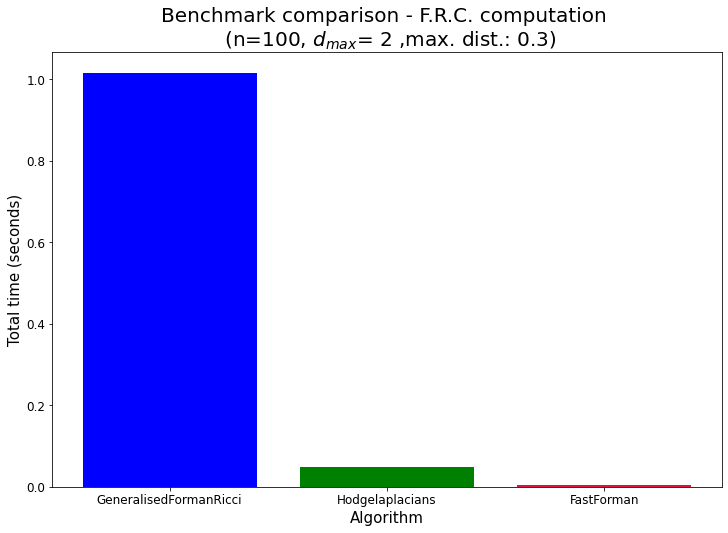
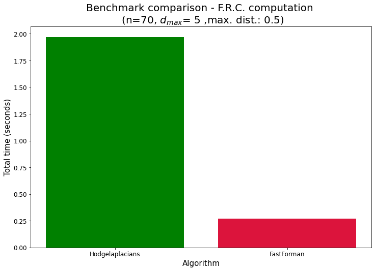

# FastForman algorithm 

## Installation:

 1. Copy and paste the content of the folder `fastforman` (i.e., the files `fastforman.pyx` and `compiler.py`) to the same directory it is intended to be installed;
 2. Run the command:
 
 ```python3 compiler.py build_ext -- inplace```
 3. After successfull compilation, the user is able to import `fastforman` as a package, for instance,
 ```python

 import fastforman as ff
    ```
  

# Time performance Benchmark

Here, we compare the time processing for computing F.R.C. by using the Python packages *GeneralisedFormanRicci*, *HodgeLaplacians* and *fastforman*.

To this purpose, we locally provided specific package versions in whitch those packages were tested:

- `GeneralisedFormanRicci:` This code computes the Forman Ricci Curvature for simplicial complex generated from a given point cloud data.
    
  Last Update: 9 of January 2021. Version: 0.3
  
  Link: https://github.com/ExpectozJJ/GeneralisedFormanRicci/
  
  
- `HodgeLaplacians:` This package provides an interface for construction of Hodge and Bochner Laplacian matrices from the set of simplices. We use `Gudhi` algorithm for generating the simpleces from point cloud data. Here, we modify the package input so that the computation can be done to restricted simplex dimensions. 

  Last Update: 2019
  
  Link: https://github.com/tsitsvero/hodgelaplacians
  
  
# Benchmark Results:

We generated point cloud data for comparing the time processing of between the algorithms in the literature. Here, we consider the total time processing - from computing the cliques to computing the FRC. We perform the process in function of the number of points and the distance threshold. To see more a detailed benchmark, visit:
https://www.kaggle.com/datasets/danillosouza2020/forman-ricci-curvature-benchmark-report

Importing packages:


```python
from time import time
import numpy as np
import re
import sys
import networkx as nx
import pandas as pd
import matplotlib.pyplot as plt
from itertools import combinations
from GeneralisedFormanRicci.frc import GeneralisedFormanRicci
from hodgelaplacians import HodgeLaplacians
import gudhi as gd
from math import dist
import fastforman as ff
```

Defining function for generating random data for test:


```python
def graph_from_cloud(data,e=2):
    G=nx.Graph()
    G.add_nodes_from([i for i in range(len(data))])
    counter=0
    for pair in data:
        G.add_node(counter,pos=(pair[0],pair[1],pair[2]))
        counter+=1
    pos_dict=nx.get_node_attributes(G,"pos")
    
    for pair in combinations(list(G.nodes()),2):
        n,m=pair
        X=pos_dict[n]
        Y=pos_dict[m]
       
        d=dist(X,Y)
        if d<=e:
            G.add_edge(n,m)
            G[n][m]['weight']=d
    return G
```


```python
#Compute cells (cliques) using Gudhi package:
def cliques_gudhi(data,f,d=2):
   
    skeleton = gd.RipsComplex(points = data, max_edge_length = f)
    Rips_simplex_tree_sample = skeleton.create_simplex_tree(max_dimension = d)
    rips_generator = Rips_simplex_tree_sample.get_filtration()

    L=[i[0] for i in rips_generator]

    return L


def run_GeneralisedFormanRicci(data,r):
   
    
    t0=time()
    #Computing simplicial complex:
    sc=GeneralisedFormanRicci(data,epsilon=r)
    #Computing FRC:
    output=sc.compute_forman()
    t1=time()
    print("Total time processing: "+str(t1-t0)+" seconds.")
    return t1-t0,output

def run_hodge(data,r,d=2):
    t0=time()
    #Computing simplicial complex
    C=cliques_gudhi(data,r,d)
        
    
    
    hl=HodgeLaplacians(C, maxdimension=d+1)
    F={}
    
    dims = [i for i in range(1,d+1)]
    #Computing FRC for each desired simplex dimension:
    for dim in dims:
            try:
                f=hl.getCombinatorialRicci(dim)
                F[dim]=f
            
              
            except:
                next
    
    t1=time()
    #   
    print("Total time processing: "+str(t1-t0)+" seconds")
    return t1-t0,F

def run_fastforman(data,f,d=2):
    #Computing list of simplicial complexes
    L=[i for i in cliques_gudhi(data,f,d) if len(i)>=2]
   
    #Generating network
    G=graph_from_cloud(data,f)
    
    t0=time()
    #Computing FRC:
    F=ff.compute_FRC(G,d)
    
          
    t1=time()
    print("Total time processing: "+str(t1-t0)+" seconds")
    return t1-t0,F

```


```python
def run_fastforman(data,f,d=2):
    
    #Computing the simplices up to the fixed dimension:
    L=[i for i in cliques_gudhi(data,f,d) if len(i)>=2]
   
    #Generating graph from provided data adn threshold:
    G=graph_from_cloud(data,f)
    Neigh={n:set(nx.neighbors(G,n)) for n in G.nodes()}
    
    t0=time()
    F=ff.fastforman(L,Neigh)
    f={dim:{} for dim in range(1,d+1)}
    for c in F.keys():
    
        f[len(c)-1][c]=F[c]
    
          
    t1=time()
    print("Total time processing: "+str(t1-t0)+" seconds")
    return t1-t0,f

```

Generating 3D point cloud Data, with n=50 nodes and threshold distance r=0.5:


```python
n=100
r=0.3
D=[np.random.uniform(0,1,3) for i in range(n)]
```

 # FRC computation (max_dim=2):


```python
dmax=2
```

- ## GeneralisedFormanRicci


```python
time_GFR,GFR=run_GeneralisedFormanRicci(D,r)
```

    Total time processing: 1.015489101409912 seconds.


```python
for d in [1,2]:
    print("Average "+str(d)+"-FRC: ",np.mean(list(GFR[d].values())))
```

    Average 1-FRC:  -1.2537688442211055
    Average 2-FRC:  2.270998415213946


- ## HodgeLaplacians


```python
time_HL,HFR=run_hodge(D,r,2)
```

    Total time processing: 0.049314022064208984 seconds


```python
for d in [1,2]:
    print("Average "+str(d)+"-FRC: ",HFR[d].mean())
```

    Average 1-FRC:  -1.2537688442211055
    Average 2-FRC:  -13.095087163232964


- ## FastForman


```python
time_FF,FFR=run_fastforman(D,r,2)
```

    Total time processing: 0.003975868225097656 seconds


```python
for d in [1,2]:
    print("Average "+str(d)+"-FRC: ",np.mean(list(FFR[d].values())))
```

    Average 1-FRC:  -1.2537688442211055
    Average 2-FRC:  2.270998415213946


### Benchmark Result (d_max=2):


```python
Vals=[time_GFR,time_HL,time_FF]
Algs=["GeneralisedFormanRicci","Hodgelaplacians","FastForman"]
Colors=["blue","green","crimson"]
plt.figure(figsize=(12,8))
plt.title("Benchmark comparison - F.R.C. computation \n (n="+str(n)+", "+r"$d_{max}$= "+str(dmax)+" ,max. dist.: "+str(r)+")",fontsize=20)
plt.bar(Algs,Vals,color=Colors)
plt.xlabel("Algorithm",fontsize=15)
plt.ylabel("Total time (seconds)",fontsize=15)
plt.xticks(fontsize=12)
plt.yticks(fontsize=12)
```


    (array([0. , 0.2, 0.4, 0.6, 0.8, 1. , 1.2]),
     [Text(0, 0, ''),
      Text(0, 0, ''),
      Text(0, 0, ''),
      Text(0, 0, ''),
      Text(0, 0, ''),
      Text(0, 0, ''),
      Text(0, 0, '')])


    

    


# FRC computation (max_dim=5):


```python
dmax=5
```

- ## HodgeLaplacians


```python
time_HL,HFR=run_hodge(D,r,dmax)
```

    /home/danillo/Documents/Github_Linux/MCEN_FastFormanRicciCurvature/FastFormanRicciCurvature/hodgelaplacians/hodgelaplacians.py:27: UserWarning: Maximal simplex in the collection has size 6. 
     maxdimension is set to 5
      warn(f"Maximal simplex in the collection has size {max_simplex_size}. \n maxdimension is set to {max_simplex_size-1}")


    Total time processing: 1.969926118850708 seconds


```python
for d in HFR.keys():
    print("Average "+str(d)+"-FRC: ",(HFR[d].mean()))
```

    Average 1-FRC:  -3.641421947449768
    Average 2-FRC:  1.0790546047269765
    Average 3-FRC:  3.348691917219836
    Average 4-FRC:  4.831988041853513
    Average 5-FRC:  -23.235364806866954


- ## FastForman


```python
time_FF,FFR=run_fastforman(D,r,dmax)
```

    Total time processing: 0.2702515125274658 seconds


```python
for d in FFR.keys():
    print("Average "+str(d)+"-FRC: ",np.mean(list(FFR[d].values())))
```

    Average 1-FRC:  -3.641421947449768
    Average 2-FRC:  1.0790546047269765
    Average 3-FRC:  3.348691917219836
    Average 4-FRC:  4.831988041853513
    Average 5-FRC:  5.9375107296137335


```python
Vals=[time_HL,time_FF]
Algs=["Hodgelaplacians","FastForman"]
Colors=["green","crimson"]
plt.figure(figsize=(12,8))
plt.title("Benchmark comparison - F.R.C. computation \n (n="+str(n)+", "+r"$d_{max}$= "+str(dmax)+" ,max. dist.: "+str(r)+")",fontsize=20)
plt.bar(Algs,Vals,color=Colors)
plt.xlabel("Algorithm",fontsize=15)
plt.ylabel("Total time (seconds)",fontsize=15)
plt.xticks(fontsize=12)
plt.yticks(fontsize=12)
```


    (array([0.  , 0.25, 0.5 , 0.75, 1.  , 1.25, 1.5 , 1.75, 2.  , 2.25]),
     [Text(0, 0, ''),
      Text(0, 0, ''),
      Text(0, 0, ''),
      Text(0, 0, ''),
      Text(0, 0, ''),
      Text(0, 0, ''),
      Text(0, 0, ''),
      Text(0, 0, ''),
      Text(0, 0, ''),
      Text(0, 0, '')])


    

    


# Conclusion:

- We compared the performance computation of F.R.C. in splicial complexes by using three Python implementations: `GeneralisedFormanRicci`, `HodgeLaplacians` and `Fastforman`. Fastforman supercedes the perfrmance of the other algorithms;


- Due to adaptations on the code of`HodgeLaplacians` for thesholding the maximum simplex dimension, a miscomputation is reported. This is caused due to an issue on computing Hodge Laplacian operators.

- We believe that our devolpments facilitates the computiation of FRC for big data.


```python

```
